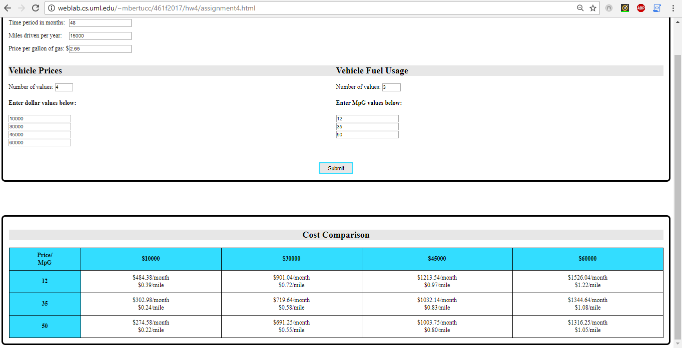

## GUI I Fall 2017 Homework #4

Single-page web application that takes user inputs for
- number of months
- number of miles
- cost per gallon of gas
- a list of car prices
- and a list of gas milages

and dynamically generates a table to compare the different costs per month and per mile.

Example screenshot: 

